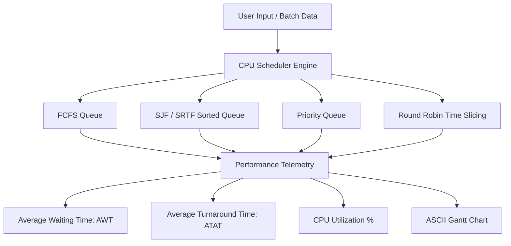

# Operating System Core Algorithms & System Calls Suite

[](https://en.wikipedia.org/wiki/C_(programming_language))
[](https://gcc.gnu.org/)
[](https://pubs.opengroup.org/onlinepubs/9699919799/)
[](https://www.mingw-w64.org/)
[](https://opensource.org/licenses/MIT)

A high-performance academic and practical laboratory suite of Operating System fundamentals implemented in standard C. Features complete coverage of CPU scheduling, process lifecycle mechanics, inter-process communication (IPC), multithreading synchronization, signal trapping, and low-level POSIX file system manipulation.

---

## Overview

Operating systems form the core layer between bare-metal computing hardware and user-space applications. This repository provides 35 modular C implementations covering core OS principles. Each module illustrates kernel-level mechanics through standard interfaces and includes cross-platform shims for compiling on both Linux/UNIX environments and Windows systems.

---

## Program Taxonomy & Curated Catalog

### 1. Process Management & Lifecycle

| Source File | Mechanism / Topic | Description |
| :--- | :--- | :--- |
| `Program1.c` | `fork()`, `wait()`, `WEXITSTATUS` | Process creation, parent wait synchronization, and exit status decoding |
| `Program3.c` | Process Tree Inspection | Inspecting child PID, parent PID, and grandparent PID hierarchies |
| `Program4.c` | Basic Process Forking | Dual-branch execution path separation between child and parent |
| `Program5.c` | Zombie & Orphan Lifecycle | Demonstrates child termination prior to parent wait release |
| `Program6.c` | Execution Delay (`sleep`) | Suspending thread execution using system clock sleep intervals |
| `Program7.c` | Identity Introspection | Querying current runtime process ID (`getpid`) and parent process ID (`getppid`) |
| `Program8.c` | Image Overlay (`execlp`) | Replacing process address space with system binary execution (`ls`) |
| `program9.c` | Fork with Exec Overlay | Child process image replacement coordinated with parent wait resumption |
| `Program11.c` | Status Code Propagation | Evaluating exit status propagation across process boundaries |
| `program16.c` | Parent-Child Synchronization | Parent suspension pending child task termination |
| `Program19.c` | Coordinated Child Execution | Sequential process execution with guaranteed completion ordering |

### 2. Inter-Process Communication (IPC)

| Source File | Mechanism / Topic | Description |
| :--- | :--- | :--- |
| `Program2.c` | Unidirectional Half-Duplex Pipe | Inter-process byte streaming between parent and child descriptors |
| `program32.c` | Pipe Buffer Serialization | String transmission and memory buffer ingestion across pipe endpoints |

### 3. Multithreading & Synchronization

| Source File | Mechanism / Topic | Description |
| :--- | :--- | :--- |
| `program10.c` | Basic Thread Spawning | Initializing and joining worker threads using POSIX threading primitives |
| `program12.c` | Argument Passing | Safely passing integer pointer references into thread entry points |
| `program13.c` | Thread Array Management | Managing multiple parallel threads with coordinated barrier collection |
| `program14.c` | Mutual Exclusion Mutex | Protecting shared accumulation variables against data race conditions |
| `program17.c` | Thread Cancellation & Cleanup | Registering cleanup push/pop handlers and processing asynchronous cancellation |

### 4. Low-Level File System Operations

| Source File | Mechanism / Topic | Description |
| :--- | :--- | :--- |
| `program15.c` | File Descriptor I/O | Creating files, sequential writing, cursor offset seek (`lseek`), and reading |
| `Program18.c` | Low-Level Access Modes | Multi-flag descriptor operations with permissions and buffer verification |

### 5. Signal Trapping & Interrupts

| Source File | Mechanism / Topic | Description |
| :--- | :--- | :--- |
| `basic.c` | Signal Interception | Trapping keyboard interrupt `SIGINT` (Ctrl+C) for graceful shutdown routines |

### 6. CPU Scheduling Algorithms

| Source File | Algorithm | Characteristics & Features |
| :--- | :--- | :--- |
| `Program20.c` | FCFS (Basic) | Non-preemptive First-Come, First-Served queue ordering |
| `Program22.c` | FCFS (Arrival Time) | FCFS scheduling accounting for staggered process arrival times |
| `program23.c` | Priority Scheduling | Sorting by priority levels to minimize higher-priority wait times |
| `program24.c` | FCFS (Sequential) | Turnaround time and waiting time calculation verification |
| `program25.c` | FCFS (Gantt Chart) | Visual ASCII timeline rendering with timeline completion offsets |
| `progra26.c` | FCFS (System Telemetry) | Advanced metrics: CPU utilization percentage and system throughput |
| `program27.c` | SJF (Non-Preemptive) | Minimizing average waiting time via sorted burst duration |
| `program28.c` | SJF (Batch Analysis) | Comparative waiting time and turnaround metrics |
| `program29.c` | SJF (Arrival Time) | SJF execution honoring dynamic arrival timestamp windows |
| `program30.c` | SJF (Gantt Chart) | ASCII Gantt chart rendering for shortest-job schedules |
| `program31.c` | SRTF (Preemptive SJF) | Shortest Remaining Time First with dynamic time-slice preemption |
| `program21.c` | Round Robin (RR) | Time-quantum sliced preemptive scheduling for responsive time-sharing |

### 7. Classic Concurrency Problems

| Source File | Problem & Approach | Description |
| :--- | :--- | :--- |
| `program33.c` | Producer-Consumer (Manual Semaphore) | Simulating mutual exclusion and buffer boundary checks via integer semaphores |
| `program34.c` | Producer-Consumer (POSIX Semaphores) | Multi-threaded producer-consumer using POSIX semaphores and mutex locks |

---

## Architecture & Data Flow



---

## Directory Structure

```text
Operating-System/
├── basic.c                  Signal handling and interrupt trapping
├── build_all.ps1            PowerShell script to compile all 35 programs
├── Program1.c               Process creation, waiting, and exit status
├── Program2.c               Inter-process pipe communication
├── Program3.c               Process identity inspection (PID, PPID)
├── Program4.c               Forking child and parent processes
├── Program5.c               Zombie and orphan process lifecycle
├── Program6.c               System sleep invocation
├── Program7.c               Process ID interrogation
├── Program8.c               Program image replacement using execlp
├── program9.c               Fork with exec overlay coordination
├── program10.c              POSIX thread creation and joining
├── Program11.c              Process wait and exit code inspection
├── program12.c              Thread parameter passing
├── program13.c              Coordinated multi-thread arrays
├── program14.c              Thread synchronization using mutex locks
├── program15.c              File descriptor creation, writing, and lseek
├── program16.c              Parent process wait synchronization
├── program17.c              Thread cancellation and cleanup handlers
├── Program18.c              Low-level descriptor I/O operations
├── Program19.c              Process sequencing and barrier waits
├── Program20.c              FCFS CPU scheduling implementation
├── program21.c              Round Robin CPU scheduling with time slices
├── Program22.c              FCFS scheduling with arrival times
├── program23.c              Priority CPU scheduling implementation
├── program24.c              FCFS turnaround and wait time verification
├── program25.c              FCFS scheduling with ASCII Gantt charts
├── progra26.c               FCFS with CPU utilization and throughput
├── program27.c              SJF non-preemptive CPU scheduling
├── program28.c              SJF turnaround and waiting metrics
├── program29.c              SJF scheduling with arrival times
├── program30.c              SJF with ASCII Gantt chart output
├── program31.c              SRTF preemptive shortest remaining time first
├── program32.c              Pipe communication buffer management
├── program33.c              Producer-Consumer simulation with semaphores
├── program34.c              Multi-threaded Producer-Consumer with pthreads
├── pthread.h                Portability header for Windows MinGW environments
├── semaphore.h              Portability header for POSIX semaphore support
├── sys/
│   └── wait.h               Portability header for process wait status macros
└── tests/
    └── test_os_suite.js     Automated test suite for syntax and algorithm execution
```

---

## Getting Started

### Prerequisites

- GCC compiler (MinGW for Windows or native GCC on Linux / macOS)
- Node.js (version 16 or newer) for executing the automated validation test suite

### Compiling Individual Programs

To compile any source file:

```bash
gcc -I. -o program.exe program23.c
```

Run the compiled executable:

```bash
./program.exe
```

### Batch Building All Programs

To compile all 35 programs into a centralized `bin/` directory on Windows:

```powershell
powershell -ExecutionPolicy Bypass -File ./build_all.ps1
```

---

## Automated Validation Suite

An automated end-to-end test suite validates all 35 source files for compilation correctness and executes algorithmic simulations against known test datasets.

Run the test suite using Node.js:

```bash
node tests/test_os_suite.js
```

Expected output:

```text
Running Operating System Practical Suite Unit Tests...

PASS: All 35 C source files discovered
PASS: All 35 C files passed GCC compilation and syntax check without errors
PASS: Program20.c (FCFS) verified with standard waiting/turnaround calculations
PASS: program27.c (SJF) verified with sorted shortest job calculations
PASS: program23.c (Priority Scheduling) verified with sorted priority calculations
PASS: program21.c (Round Robin) verified with time slice quantum preemption

All 5 Operating System test suites passed successfully!
```

---

## Technical Specifications

| Parameter | Specification |
| :--- | :--- |
| Standard | ANSI C / ISO C99 |
| Compiler Compatibility | GCC 4.8+, Clang 3.5+, MinGW-w64, MSYS2 |
| POSIX Compatibility | IEEE Std 1003.1-2008 |
| Shims Included | `<sys/wait.h>`, `<pthread.h>`, `<semaphore.h>` |
| Testing Framework | Node.js child_process validation harness |

---

## License

This project is licensed under the MIT License. Open source and available for academic, personal, and commercial reference.
